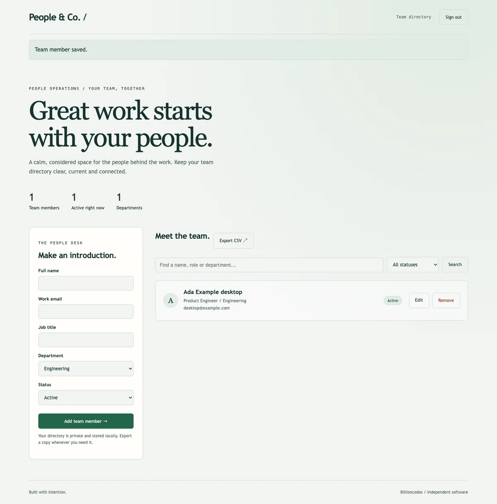

# People & Co. / Staff Management System



A private team directory: staff CRUD, search, status filters, department summaries and spreadsheet-safe CSV export. PHP 8.2+ with PDO SQLite. No build step or Composer dependency.

This is a new, independently written implementation of the staff-management concept from Josiah Adeyemo's portfolio, not recovered Laravel/Blade source. The stack is deliberately PHP and SQLite.

## Run

```sh
export APP_PASSWORD='choose-a-strong-workspace-password'
php -S 127.0.0.1:5102 -t public public/index.php
```

Open http://127.0.0.1:5102 and sign in. APP_PASSWORD requires at least 12 characters. No sample credentials or real employee data are included.

## Test

```sh
php tests.php
```

Checks creation, updates, deletion, uniqueness, invalid input, optimistic concurrency, HTML escaping and CSV formula protection. Repeated/stale edits cannot silently overwrite another revision.

## Operations

DATABASE defaults to data/app.sqlite; back it up. Serve only public/, never the repository root. For production use PHP-FPM behind TLS, set COOKIE_SECURE=true, keep secrets in the environment and apply reverse-proxy rate limits. The built-in PHP server is for local development. Forms are session-authenticated and CSRF-protected; login attempts are throttled in SQLite. This is a single-operator directory, not a payroll or multi-tenant HR platform. There is no deployed live service attached to this repository.
