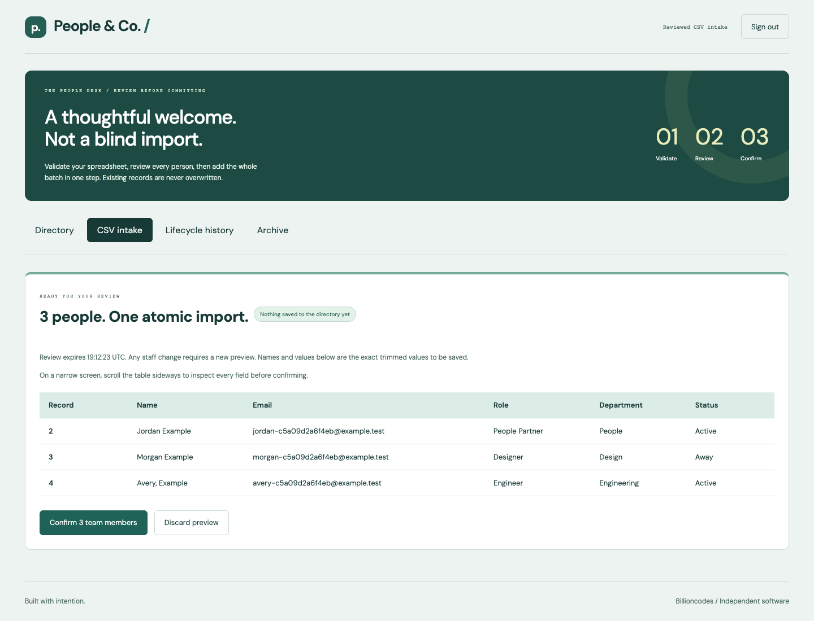
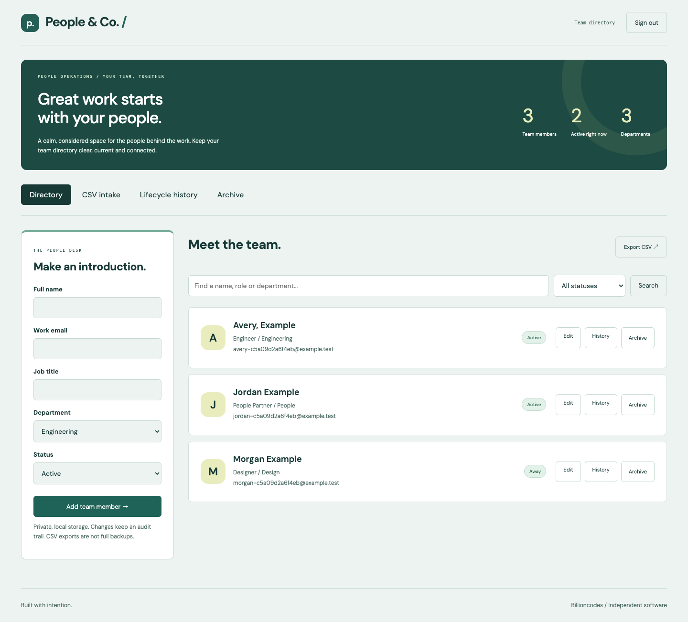
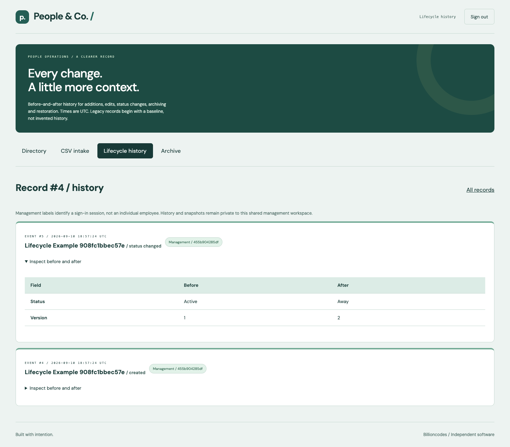

# People & Co. / Private People Desk

A local, single-operator staff directory with reviewed CSV intake, lifecycle history and operator backup/restore. PHP 8.2+ with PDO SQLite; no runtime JavaScript, Composer dependency or build step. The existing green People & Co. design and local DM typography are retained.



## Run Privately

From this repository, set your own unique password (at least 12 characters). The prompt below reads it without displaying it or placing it in shell history:

```sh
printf 'Workspace password: '
read -rs APP_PASSWORD
export APP_PASSWORD
export DATABASE="$PWD/data/app.sqlite"
php -S 127.0.0.1:5305 -t public public/index.php
```

Open [the local workspace](http://127.0.0.1:5305). No default password or staff data is seeded. The password is required at every server start. Another loopback port works for normal use; repository browser tests reserve **5305 and 5306**, so stop the manual test preview before running them. Existing previews on other ports are not changed.

Serve **only `public/`**, never the repository root. This release explicitly accepts only loopback clients and localhost/loopback Host headers. Do not expose it with tunnels, proxy forwarding or a public web server. Configuration without a password stays locked. `COOKIE_SECURE=true` is available for an operator-managed local HTTPS setup; do not enable it for plain HTTP.

## One Complete Intake Workflow

1. Sign in and open **CSV intake**. Download the synthetic template or upload/paste your own UTF-8 CSV, not both.
2. Validate the entire file. Every invalid record must be corrected; no partial import or silent upsert is possible. Record numbers include the header as record 1.
3. Review the exact trimmed names, email addresses, roles, departments and statuses. Confirm the complete batch once. A repeated confirmation in the same session returns its durable receipt instead of duplicating people.
4. Edit a staff record, change its status or archive it. Inspect **Lifecycle history**, including before-and-after values. Restore an archived record from **Archive** when needed.
5. Use the operator commands below to create a full backup and safely roll back a workspace with a recovery copy of the replaced state.

CSV header, exact order and case:

```csv
name,email,role,department,status
Alex Example,alex@example.test,Coordinator,Operations,Active
```

The maximum is **200 staff rows / 128 KiB**. UTF-8 BOM, CRLF/LF, quoted commas and doubled quotes are supported. Quoting must be well-formed. Each field is required, single-line UTF-8 text, at most 160 bytes after trimming. Multiline quoted CSV is parsed but rejected at field validation. Blank rows are errors. Departments: Engineering, Design, Operations, People, Sales. Statuses: Active, Away, Inactive. Email addresses must be unique case-insensitively, including archived people and duplicates within the CSV.

Each valid review is stored server-side, bound to the management session and the directory generation, and expires after **15 minutes**. Any subsequent staff mutation requires a fresh preview. The confirm POST cannot substitute different rows. A database failure rolls back staff, audit and confirmation together. Confirmed receipts retain the count rather than a second copy of staff values; unconfirmed expired reviews are removed on the next authenticated request. Logout/expiry requires a new review. Discard and re-upload if a review becomes stale.

## History And Compatibility

- Existing SQLite staff IDs, field values, versions and creation dates migrate in place without reseeding or deletion. Each old record receives a clearly labelled migration baseline; earlier history is unknown. Keep a stopped-server filesystem copy before upgrading.
- Changes and audit events commit in the same transaction. No-op saves do not create revisions. Stale saves retain the submitted draft for comparison, but require reloading the current record before resubmission.
- Archive is non-destructive and reserves the email address. Restore is version-checked. There is no hard-delete control or automatic retention purge; audit history and archived records contain personal data.
- `/`, `?edit=ID`, search/status filters and authenticated `?export=1` remain available. Legacy `action=delete` submissions now archive safely. CSV export retains the original six-column format and spreadsheet-formula protection, excludes archived people and is **not** an intake template or a full backup.
- Management passwords, CSRF checks and SQLite login throttling remain. Sessions now expire after eight hours, rotate on login/logout, and invalidate on password changes or database restore. Old pre-upgrade sessions require sign-in again. HTML and downloads are no-store; external-origin form posts and invalid Host headers are rejected.
- Audit actor labels identify a shared management sign-in session, **not an individual identity**. Application audit rows reject updates/deletes, but an OS/database administrator can alter files; this is not tamper-proof compliance logging.

## Backup And Restore

Run the CLI as the trusted local operator. `APP_PASSWORD` is not needed by the CLI; OS filesystem permissions are its authorization boundary. Backups contain all staff and history, including archived values and pending reviews. They are **not encrypted**. Use a private directory and an encrypted volume/backup destination where appropriate; never upload snapshots to a public site.

```sh
export DATABASE="$PWD/data/app.sqlite"
mkdir -p "$PWD/data/backups"
chmod 700 "$PWD/data/backups"
php bin/workspace.php backup "$PWD/data/backups/before-intake.sqlite"
php bin/workspace.php verify "$PWD/data/backups/before-intake.sqlite"
```

`backup` takes a consistent SQLite `VACUUM INTO` snapshot, validates integrity/schema, flushes the file, sets mode 0600 and prints counts plus SHA-256. Existing destinations are never overwritten. Use a new filename for each snapshot. Backup includes a migration if the existing workspace is still on the old schema. `verify` checks integrity, version and basic state; its checksum can be compared with the original backup report. A checksum does not authenticate an untrusted backup.

**Stop the PHP server and every other database writer before restoring.** Use only a trusted snapshot from the same migrated workspace:

```sh
php bin/workspace.php restore "$PWD/data/backups/before-intake.sqlite" --confirm
```

Restore refuses active cooperating app connections, unknown/mismatched schemas, corrupt snapshots, public paths, symlink files, absent confirmation and SQLite WAL/journal sidecars. It validates a same-directory staged copy, creates and verifies `app.sqlite.before-restore-TIMESTAMP-RANDOM.sqlite`, rotates the session epoch, clears intake tokens, appends a restore event, flushes, then atomically renames the stage over the workspace. The original backup is not modified. Its JSON output reports the recovery-copy path. To undo the restore, stop writers again and restore that recovery copy with the same command. History after the selected backup lives in the recovery copy, not in the rolled-back workspace.

Focused recovery limits: source snapshots must be version 1 and at most 256 MiB; the current workspace must still be readable, healthy and use DELETE journal mode. This CLI handles logical rollback, not automatic recovery from an already corrupt/missing database or a hardware failure. Locks coordinate this app and CLI only, not arbitrary SQLite editors. Keep separate protected offline copies and test recovery before entrusting real staff data. There is no web restore endpoint, automatic backup schedule or cloud backup.

## Verification

Local verification on 2026-09-10: **13 core cases, 16 desktop/mobile cases and all 8 PHP source lint checks passed**. Full `npm audit --json` reported zero known dependency vulnerabilities. CI configuration includes these suites but has not been pushed or run remotely for this change.

```sh
php tests.php
find src public bin -name '*.php' -exec php -l {} \;
npm ci
PLAYWRIGHT_CHANNEL=chrome npm run test:e2e
```

For CI without installed Chrome: `npx playwright install --with-deps chromium`, then `npm run test:e2e`. Node 22+ is only needed for tests. All tests create isolated synthetic databases under ignored `.test-data/`; none reads the normal `data/app.sqlite`. Browser test servers stop when the run ends. Test screenshots in `docs/` are refreshed by the actual browser tests. Synthetic database/trace leftovers can be removed after review; they are never committed.

Core coverage includes old-schema migration, validation and uniqueness, lifecycle revisions, stale/no-op writes, append-only audit, injected rollback failures, strict CSV grammar/limits, complete error reporting, session-bound review tokens, exact expiry, stale generations, durable concurrent-process confirmation and real CLI backup/restore/recovery-copy operations. Browser coverage exercises desktop/mobile login, CSRF/Host/Origin boundaries, upload and row errors, preview/confirm/retry, history/archive/restore, stale previews and editors, restore-induced sign-out, session expiry, throttling, automated WCAG A/AA checks and horizontal overflow.




[Mobile intake](docs/intake-mobile.png) / [mobile directory](docs/directory-mobile.png) / [mobile history](docs/history-mobile.png)

## Deliberate Limits

This is a private local pilot, not a deployed HR, payroll or multi-tenant service. **Emergency/contact fields, expiring contact-access grants, separate users/roles, encryption at rest, retention policies and public hosting are not delivered.** Do not place sensitive contact/medical notes in ordinary fields. All management sessions can view all staff/history. Retention, operating-system security, protected backup storage, manual accessibility review and a real-user pilot remain operator/release responsibilities. No messages, accounts, payments or external integrations are activated.

This is an independently written implementation of the staff-management concept from Josiah Adeyemo's portfolio, not recovered Laravel/Blade source.
